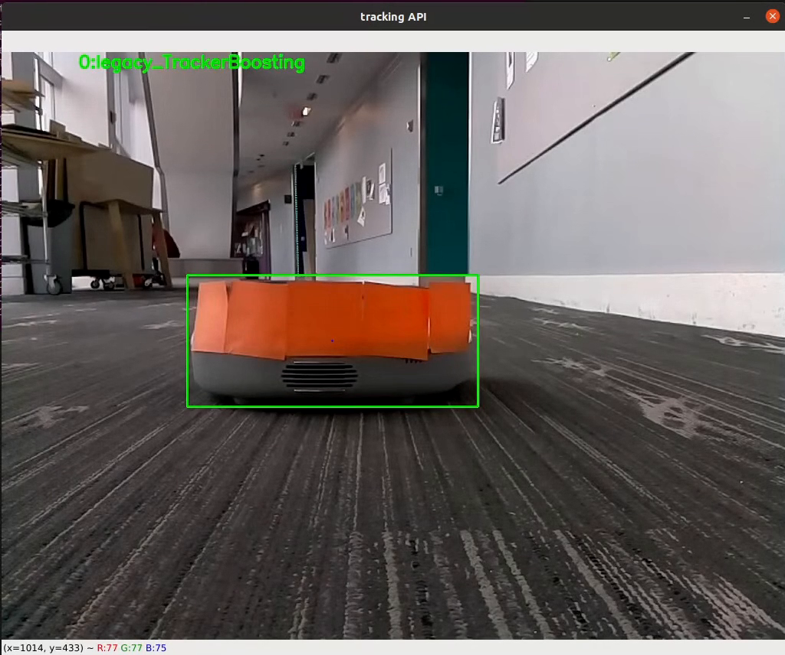
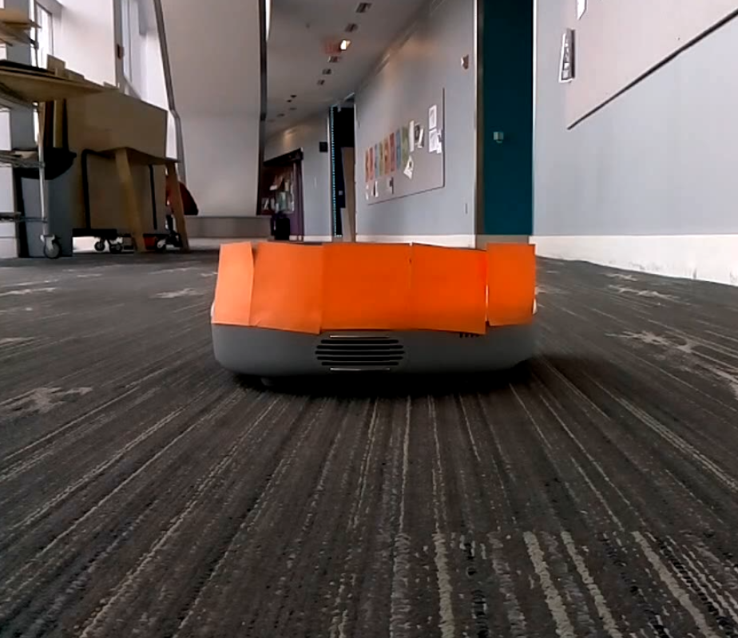
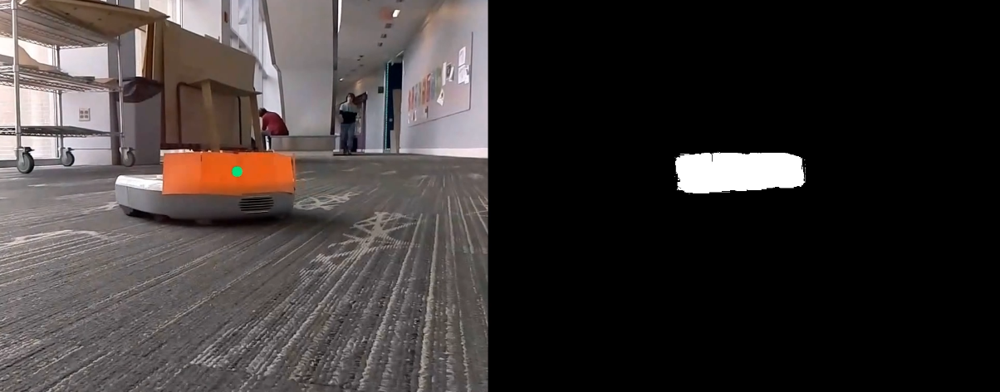
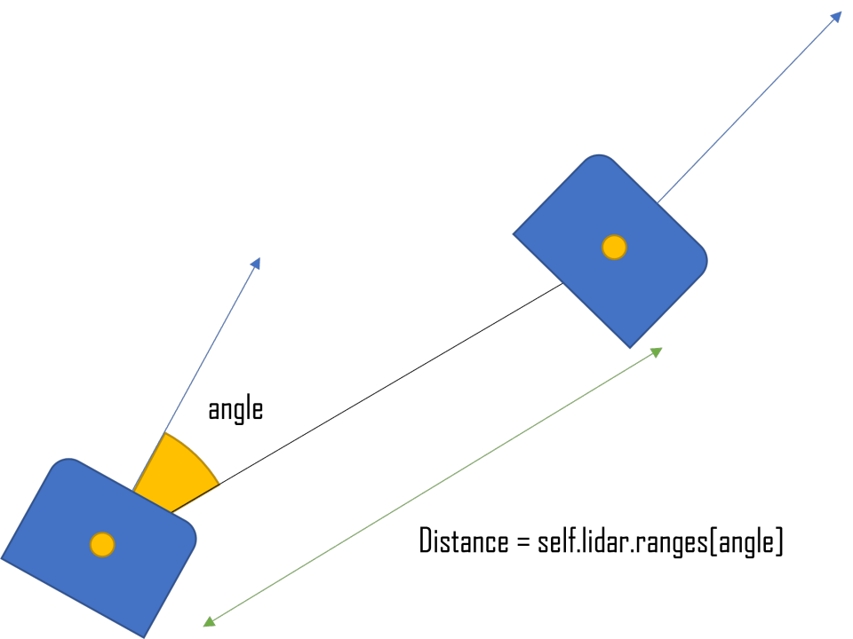

# NeatoFollowingNeato

## Run

- Clone this repo in your ros2 workspace source folder (ex. ros2_ws/src/)
- After the build, run the following code to test the color detection approach:
```
ros2 run neato_following_neato neato_tracker_color 
```
- After the build, run the following code to test the the OpenCV Tracking API approach:
```
ros2 run neato_following_neato neato_tracker_api
```

## Overview

Quite true to its name, this project is about Neato following Neato that can create a line of slithering Neatos, with the only limiting factor being the number of available Neatos to connect to (Actually, with more computers, we can have an infinite number of Neato following each other). The Neato placed at the front of the line is controlled manually by the user, and the successive line of Neatos will follow suit. A demonstration of the train of Neatos following each other can be found under the [Demo](#custom_anchor_name) section below.

This project was inspired by an in-class lab, ["Neato Soccer"](https://github.com/comprobo22/class_activities_and_resources/tree/main/neato_soccer), where we would first filter images from the Neato's video feed to isolate the soccer ball, extract the ball's center of mass, then use the information for the Neato to dribble the soccer ball. The color-filtering approach used in the in-class lab is very much alike to our color detection approach. 

## Goal

To achieve the goal of Neato following Neato, there were several tasks:

1. Neato should be able to locate another Neato that is in front of it.
2. Neato should be able to figure out the distance from the other Neato.
3. From the information above, Neato should be able to control its velocity to follow another Neato.

The main concern was the first task. We decided on using computer vision to locate another Neato, and we considered several different algorithms to see what will work well, and also be done in the time frame of this project.

The second task can be done in two different ways. Depending on the algorithm, the computer vision part can figure out the distance between the Neatos. Also, Neato has a built-in LIDAR scan that can detect objects around it, so as far as we know the angle between two Neatos we will also be able to get the distance between them.

For the last task, it will be best to implement proportional velocity control based on the angle/distance we got from steps 1 and 2. 

## Approach

### Color Detection

Color detection was the easiest algorithm to implement, while it was still pretty strong. The basic idea under this method is that you pick all the pixels from the image that falls into the specified boundary. For example, if we want to detect the "Orange" color, we should give the boundary of (R: 210-250, G: 100-140, B: 0-40) and most of the orange-ish color will fall within the boundary. Despite the simplicity, color detection worked well in real time.

The main issue with this method was the limitation on color choices and the instability of lighting. Because Neato did not have a distinct color that can be separated from the background, Neato should be attached to something that has distinct colors such as post-its. Also, the color value of pixels changes dramatically under different lighting. This means that settings for the boundaries should be adjusted every time program runs, and the algorithm might not work well when the Neato is passing by strong light or shadow of an object. 

Despite all the drawbacks, this was the algorithm we focused on. It was still very reliable as far as we can control the environment, and there are some additional algorithms we can implement to get rid of the limitations. 

### Keypoint Matching

Keypoint matching was another algorithm that we tried but realized would not be as simple as color detection. We tried first with the SIFT descriptor, and immediately realized several issues:

1. Neato's shape makes it hard to have many descriptors on the Neato (especially since it is far away), making it difficult to match. 
2. Keypoint matching had the same issue with lighting as the color detection, where it became harder to recognize Neato as the lighting changed from the given image.
3. As Neato approached another Neato, the angle and size camera see the object changed, causing inconsistency in how descriptors are created.

Because of these reasons we needed to do something more to achieve the task through keypoint matching. One method we considered was to create a number plate for the Neatos, which will give a distinct object to detect and enhances the visuals. We ended up not trying this due to the time limitation, but we still saw the possibility of implementing keypoint matching for this project.

### OpenCV Tracking API

[](https://youtu.be/dTCCLRyEKFs)
↑ Click to view the video

The alternative back-up approach was using OpenCV's tracking API to specify the region of interest (where the Neato would be in the frame) and take the center of that region to follow a leading Neato. To do this, the user is first prompted to draw a rectangle in the frame that would become the region of interest. Once this is done, the API handles identifying the characteristics of the region of interest throughout the test. In our approach, we decided to use ```cv2.TrackerBoosting_create()```. If the user wishes to test out other tracking methods, this can be done so by changing ```self.trackerIdx```.

<a name="custom_anchor_name"></a>

## Demo

[](https://youtu.be/cAolaKo4dqg)
↑ Click to view the video

We decided to achieve the task with real-time color detection through the camera and LIDAR scan. Under a controlled environment where there is no big difference in lighting, and no extra object that falls into the color boundary, the code works well and achieved the goal of following Neato in front of it. We were able to run the code in multiple Neatos and created something like a Neato train!

## Design Decisions

[](https://youtu.be/BhG1ZUt1OvM)
↑ Click to view the video

### Attaching Post-its to Neato



We found immediately that Neato did not have a distinct color that we can use for color detection. The decoration that covers the LIDAR sensor had a color that we can detect (such as blue, green, and purple) but they were too small and hard to detect at longer distances. Also, we realized that Neato's LIDAR scan cannot figure out where the other Neato is because the LIDAR sensor is located above Neato's height. To solve both of these problems, we attached post-its with different colors - this will provide Neato with a color that is different from the environment, and also raise Neato's height so that it shows up on the LIDAR scan. 

### Automatic Boundary Setting


As we mentioned earlier, the color value of pixels changes dramatically under different environments. So there was a need to set up the color boundaries automatically to adjust to a new environment, and this was done by clicking a pixel from the camera feed. For example, if we set the boundary range to 30 and click a pixel that is (R: 150, G: 120, B: 90) then the boundary will be (R:120-180, G: 90-150, B: 60-120) and will detect every pixel in that range. 

### Centroid Detection Through Binary Image



Once we set up the boundaries and create a binary image, we can calculate the centroid of all the pixels in the boundary. To do this, we used OpenCV's moments function.

```python
moments = cv2.moments(self.binary_image)
if moments['m00'] != 0:
    self.center_x = int(moments['m10']/moments['m00'])
    self.center_y = int(moments['m01']/moments['m00'])
```
Through this process, we were able to get the position of the centroid on the current frame. You can see on the left part of the picture that shows a centroid as a green circle. Once we know the circle, we can calculate the angle between two Neatos, information that we can use to rotate the Neato toward the other Neato's direction. Getting the equation to get the exact angle value was done through manual calibration and measurements since each Neato is set up differently.

### Proportional Angular and Linear Velocity



```python
self.drive_msg.angular.z = -self.tendency_x * 2
if self.isProportional:
    if self.lidar != None:
        angle = int(-self.tendency_x * 100)
        distance = self.lidar.ranges[angle]
        # ignore occasional 0 value for the distance
        if distance < 0.5 and not distance == 0.0:
            self.drive_msg.linear.x = 0.1
        elif not distance == 0.0:
            self.drive_msg.linear.x = (distance-0.5) * 0.2 + 0.1
```

From the angle information, self.tendency_x (angles from -50 to 50 degrees, but divided by 100), we can set the angular speed to be proportional. Neato will rotate faster if there is a big angle difference, and slower if tendency_x is closer to 0. 

Proportional linear speed is a bit more complicated. We had to use Neato's LIDAR scan data, and since we know the angle between two robots, we just had to look at the single scan data at the angle. From there we can get the distance between two robots, which can be used to control how fast the Neato should approach another Neato. 

### Testing Mode and Real Mode

One last design choice we made was implementing the test mode. During test mode, we can check our color tracking algorithm using pre-recorded videos, which helped a lot in fast prototyping. The code is written so that transition between real mode and test mode is simple, just setting a boolean value to True or False. The next plan was to improve the test mode so that it can also work with bag files, which would give a more realistic simulation.

## Challenges

### Modification to Neato Required

It was challenging to make the project work without doing any modifications to Neatos. For the particular implementation we did, we needed to attach 4 to 5 post-its to the Neatos for color detection and LIDAR scan. This raises the complexity as we add more and more Neatos to the algorithm - for example, in the demo video we presented in the beginning, we had to choose two colors that are very different to avoid possible boundary overlap. We guess the maximum number of Neatos we can control at the same time would be around 4 to 5 due to this limitation. Also, setting up takes extra time, which was a big factor that slowed down our testing process. 

Another modification to the Neato that was required involved attaching post-its strictly in the upright direction and not the downward direction. This condition was required due to the elevation at which the camera was mounted on the Neatos--the camera was placed at a high elevation such that it could not detect the post-its that were applied in the downward direction in front of them. 

### Sensitivity to the Environment

This was the biggest challenge - how well the algorithm worked depended on the time of the day (lighting) and where it was tested (object nearby). When testing on a cloudy day, the entire MAC was lit evenly in the same shade of lighting. This consistency in the lighting provided an apt environment for the Neato to follow a preceding Neato without being led astray in a totally random direction. On a sunny day, however, the MAC had uneven lighting down the hallway due to shadows created by shelves, desks, chairs, etc. The brightness also emphasized the color of certain objects that fell within the Neato's vision, hindering our color detection. For example, when a preceding Neato had a bright orange post-it on it, the following Neato would at one point move towards the glass-window--it was detecting a bright red lawn chair in the Oval.   

### Difficulty with Proportional Speed

When designing the behavior of succeeding robots, we tested between proportional speed (where the speed of the following robots would depend on the distance between the Neato and the leading Neato) and hard-coded speed (where all the following Neatos had the same speed) to decide which approach would display the most seamless movement. Before testing, we expected proportional speed to allow not only a smoother movement but also as a collision-proof mechanism. But to our surprise, proportional speed displayed a rather choppy movement--where it would speed up so quickly for a short while, get to close to the leading Neato, would halt, and repeat the whole process. This was due to the fact that LIDAR scan data sometimes returned the value 0 or value with big difference from previous value.

## Improvements

Considering the challenges mentioned above, here is a list of the improvements/next steps that can be taken: 
1. Real-time adjustment to the tracking pixel (pick a pixel automatically)
2. Use HSV instead of RGB and see if it works better
3. Smarter way to achieve proportional speed
4. Control multiple neatos from one computer
5. Syncing up the speed of the different robots (e.g. using the odometry of each robot)

## Lessons

One big lesson after working on this project is that we were able to fathom the significance in being aware of the discrepancy between a robot in a real-world environment versus a robot in our virtual environment/code. We've encountered so many real-world challenges and had to pinpoint which challenge was causing an unexpected behavior in the Neato--which mostly involved the Neato turning and charging in random directions. This whole debugging process is what really stays with us.
